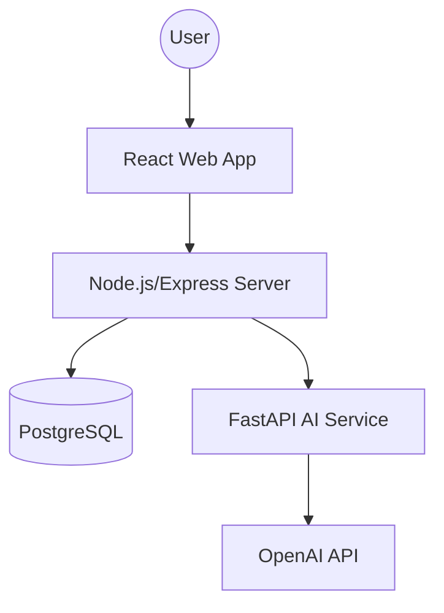

# System Architecture

## 🏗️ High-Level Architecture
The system follows a decoupled, three-tier architecture to separate concerns between the User Interface, Business Logic, and Specialized AI Processing.

## 🌐 Component Details

### 1. Frontend (`apps/web`)
- **Framework**: React with Vite for fast bundling.
- **State Management**: `Zustand` for lightweight, global auth and user state.
- **Styling**: `Tailwind CSS` for a professional, responsive SaaS-like design.
- **Routing**: `React Router v6` with a `ProtectedRoute` wrapper for RBAC.
- **API Client**: `Axios` instance with interceptors for JWT handling.

### 2. Backend (`apps/server`)
- **Runtime**: Node.js with Express.
- **ORM**: `Prisma` for type-safe database access and migrations.
- **Database**: `PostgreSQL` for relational data integrity.
- **Middleware**:
    - `authenticate`: Validates JWTs from the Authorization header.
    - `authorize`: Role-based access control (RBAC) ensuring users can only access resources permitted for their role.
- **Service Layer**: Decouples business logic (e.g., `matchingService.js`) from HTTP controllers.

### 3. AI Service (`apps/ai-service`)
- **Runtime**: Python with FastAPI.
- **Core Logic**:
    - **PDF Parsing**: `PyMuPDF` (fitz) for extracting text from resumes.
    - **LLM Integration**: OpenAI GPT-4o for semantic analysis and structured JSON extraction.
- **Communication**: Exposes REST endpoints called by the Node.js backend.

## ⚙️ Core Logic Flows

### Deterministic Matching Engine
To avoid "Black Box" AI results, the matching score is calculated on the backend:
$\text{Final Score} = (0.70 \times \text{Skill Match}) + (0.20 \times \text{Eligibility}) + (0.10 \times \text{Career Interest})$

### Verification Flow
1. **Submission**: Student adds a Project/Certificate (`isVerified = false`).
2. **Review**: Faculty/Admin views the pending item via `VerificationDashboard`.
3. **Validation**: Reviewer checks the provided URL/Document.
4. **Approval**: Backend updates `isVerified = true` and sets `verifiedBy = adminId`.

## 🔒 Security Model
- **Auth**: JWT tokens issued upon login, stored in state/local storage.
- **Permissions**: Roles defined as `STUDENT`, `INDUSTRY`, `FACULTY`, `INSTITUTION_ADMIN`.
- **Data Isolation**: API endpoints verify that the `userId` in the token matches the owner of the resource being modified.
